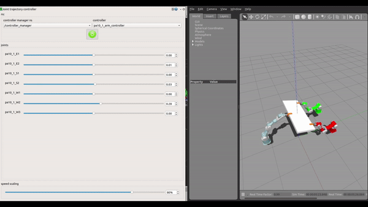

## Synopsis

ROS packages for the Mitsubishi PA10 7-DOF Arm developed by Control Systems Lab, National Technical University of Athens.
The package contains the configuration and description files for the static manipulator and for multiple cooperative manipulators.

## Dependences
* **ROS Packages:**
    * [MoveIt ROS](http://moveit.ros.org/)
    * [joint state publisher](http://wiki.ros.org/joint_state_publisher)
    * [robot state publisher](http://wiki.ros.org/robot_state_publisher)
    * [joint limits interface](http://wiki.ros.org/joint_limits_interface)
    * [xacro](http://wiki.ros.org/xacro)
    * [ros_control](http://wiki.ros.org/ros_control)
    * [controller_manager](http://wiki.ros.org/controller_manager)
    * [gazebo ros control](http://wiki.ros.org/gazebo_ros_control)


## Installation
```sh
$ roscd && cd ../src
$ git clone https://github.com/mlogoth/PA10.git
$ cd .. && catkin_make
```
## Gazebo
For single robot gazebo simulation:

```sh
roslaunch pa10_gazebo pa10.launch
```
## Gazebo + MoveIt
To run the Gazebo + Pa10 Controllers + MoveIt :
```sh
roslaunch pa10_gazebo pa10_moveit.launch rviz:=true
```
Set the argument ```rviz := true``` to launch RViz. 

##  Multiple Robots
To launch multiple static manipulators on Gazebo run the following:
```sh
roslaunch pa10_gazebo pa10_multi.launch
```
If you like to simulate the robots as they are rigidly connected with an object
```sh
roslaunch pa10_gazebo pa10_multi.launch cooperative:="true"
```
Then you can choose between 2 or 3 agents and box or cylinder object
```sh
roslaunch pa10_gazebo pa10_multi.launch cooperative:="true" object_type:="box|cylinder" agents:="2|3"
```
  
